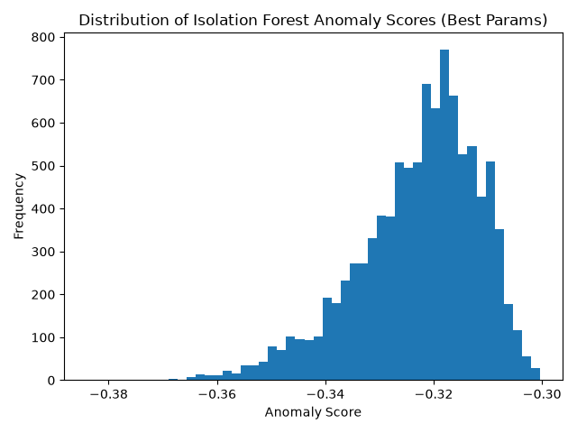

# NYC 311 Data Quality & Anomaly Detection Pipeline

End-to-end data engineering project that ingests live NYC 311 service request data, performs automated data quality profiling, detects anomalous records with machine learning, and supports orchestration through Airflow-compatible DAG logic.

This project is designed to demonstrate practical data engineering skills across ingestion, validation, feature preparation, artifact generation, orchestration, and reproducible local execution.

## Why this project matters

Public service request data is high-volume, semi-structured, and operationally noisy. A reliable pipeline for this type of dataset should do more than ingest records — it should also:

- validate data quality before downstream use
- surface missingness and distribution shifts
- flag unusual operational patterns for investigation
- produce consumable artifacts for analysts and stakeholders
- run reproducibly in both local and orchestrated workflows

This repository implements that workflow on top of the NYC Open Data 311 API.

## What this project demonstrates

- API-based ingestion of live public-sector operational data
- reproducible data pipeline design with modular Python scripts
- structured data quality reporting in machine-readable output formats
- shared feature engineering for ML stages to reduce logic drift
- anomaly detection with `IsolationForest` over categorical, temporal, and geospatial features
- hyperparameter evaluation with persisted experiment results
- orchestration-ready task design via Airflow DAG structure
- Windows-friendly local execution path when native Airflow support is limited

## Architecture

```text
NYC Open Data API
        |
        v
fetch_nyc311.py
        |
        v
nyc311_sample.csv
        |
        +--> data_quality_check.py ----> nyc311_quality_report.json
        |
        +--> ml_anomaly_detection.py --> nyc311_anomalies.csv
        |
        +--> hyperparameter_tuning.py -> hyperparam_search_results.csv
                                         nyc311_best_hyperparams.json
                                         anomaly_score_hist.png
```

### Orchestration options

- `scripts/run_pipeline.py` executes the full pipeline locally in DAG order
- `airflow/dag_nyc311_data_quality.py` defines the Airflow task graph for orchestrated execution
- `scripts/pipeline_utils.py` centralizes path handling and shared model preprocessing

## Pipeline stages

### 1) Data ingestion
`scripts/fetch_nyc311.py`

- pulls up to 10,000 recent NYC 311 requests from the public API
- applies request timeout and HTTP status validation
- selects a focused set of operational columns
- writes the raw working dataset to `data/nyc311_sample.csv`

### 2) Data quality profiling
`scripts/data_quality_check.py`

- calculates shape, missingness, duplicate count, and schema details
- summarizes key field distributions such as complaint type and borough
- writes a structured quality report to `data/nyc311_quality_report.json`

### 3) Anomaly detection
`scripts/ml_anomaly_detection.py`

- builds a shared model matrix using:
  - categorical attributes such as agency, complaint type, descriptor, borough, city, and ZIP
  - temporal features derived from request timestamps
  - geospatial coordinates and derived resolution time
- trains an `IsolationForest` model
- adds anomaly labels and anomaly scores
- saves flagged records to `data/nyc311_anomalies.csv`

### 4) Hyperparameter tuning
`scripts/hyperparameter_tuning.py`

- evaluates multiple `IsolationForest` parameter combinations
- logs tuning runs to `data/hyperparam_search_results.csv`
- persists the selected configuration to `data/nyc311_best_hyperparams.json`
- saves an anomaly score distribution plot to `data/anomaly_score_hist.png`

## Repository outputs

| Artifact                             | Purpose                                                |
|--------------------------------------|--------------------------------------------------------|
| `data/nyc311_sample.csv`             | Raw working dataset pulled from the API                |
| `data/nyc311_quality_report.json`    | Structured profiling report for data quality checks    |
| `data/nyc311_anomalies.csv`          | Records flagged as anomalous, including anomaly scores |
| `data/hyperparam_search_results.csv` | Logged tuning experiments and evaluation metrics       |
| `data/nyc311_best_hyperparams.json`  | Best-performing model configuration summary            |
| `data/anomaly_score_hist.png`        | Distribution of anomaly scores for the selected model  |

## Tech stack

- Python
- Pandas
- NumPy
- scikit-learn
- Matplotlib
- Requests
- Apache Airflow

## Data source

- [NYC 311 Service Requests API](https://data.cityofnewyork.us/resource/erm2-nwe9.json)

## Automated weekly refresh (GitHub Actions)

This repository includes a scheduled workflow at `.github/workflows/weekly-nyc311-refresh.yml` that:

- it runs every week and can also be started manually
- executes the full pipeline (`scripts/run_pipeline.py`)
- rebuilds the README report snapshot (`scripts/update_readme_report.py`)
- commits refreshed report artifacts back to the repository

<!-- AUTO_REPORT_START -->
### Weekly Automated Report Snapshot
_Last updated: 2026-06-22 12:02 UTC_

#### Data quality report (`data/nyc311_quality_report.json`)
- Row count: 10,000
- Column count: 12
- Duplicate rows: 0
- Top complaint types:
- Noise - Residential: 1,950
- Illegal Parking: 1,682
- Noise - Street/Sidewalk: 1,451
- Blocked Driveway: 551
- Noise - Commercial: 258

#### Best hyperparameters (`data/nyc311_best_hyperparams.json`)
- n_estimators: 50
- max_samples: auto
- contamination: 0.0100
- Predicted anomaly rate: 0.0100
- Score gap (P50-P01): 0.0342

#### Hyperparameter search top runs (`data/hyperparam_search_results.csv`)
| Rank | n_estimators | max_samples | contamination | score_gap_p50_p01 | predicted_anomaly_rate |
|---:|---:|---:|---:|---:|---:|
| 1 | 50 | auto | 0.01 | 0.034157641607220846 | 0.01 |
| 2 | 50 | auto | 0.05 | 0.034157641607220846 | 0.05 |
| 3 | 100 | auto | 0.01 | 0.028918505176308174 | 0.01 |
| 4 | 100 | auto | 0.05 | 0.028918505176308174 | 0.05 |
| 5 | 50 | 0.7 | 0.01 | 0.023364237617899908 | 0.01 |

#### Anomaly score distribution (`data/anomaly_score_hist.png`)

<!-- AUTO_REPORT_END -->

## How to run

### Local pipeline execution

Run the full workflow locally:

```powershell
python scripts\run_pipeline.py
```

Or run each stage individually:

```powershell
python scripts\fetch_nyc311.py
python scripts\data_quality_check.py
python scripts\ml_anomaly_detection.py
python scripts\hyperparameter_tuning.py
```

To refresh the README report block from the latest generated artifacts:

```powershell
python scripts\update_readme_report.py
```

### Airflow execution

The project includes an Airflow DAG in `airflow/dag_nyc311_data_quality.py`.

For actual Airflow scheduler / CLI usage, use Linux or WSL2:

```powershell
pip install -r requirements-airflow.txt
```

## Windows note

Native Apache Airflow is not fully supported on standard Windows Python. Recent Airflow versions can fail with Unix-specific dependency errors such as:

- `ModuleNotFoundError: No module named 'fcntl'`
- `AttributeError: module 'signal' has no attribute 'SIGALRM'`

For that reason, this repository includes `scripts/run_pipeline.py` as the recommended Windows execution path.

## Data engineering highlights

This project is especially relevant for data engineering roles because it demonstrates:

- ingestion from an external API into a reproducible local data asset
- automated profiling and validation before downstream ML processing
- modular pipeline design with reusable preprocessing components
- orchestration-aware task decomposition and artifact-based workflow design
- experiment logging and output persistence for repeatable model analysis
- pragmatic handling of platform constraints through documented run modes

## Future improvements

- add automated tests for script outputs and schema expectations
- externalize configuration for paths, limits, and model parameters
- persist fitted preprocessing and model artifacts for reuse
- compare multiple anomaly detection approaches beyond Isolation Forest
- deploy the orchestration layer in Docker or WSL2 for closer production parity

